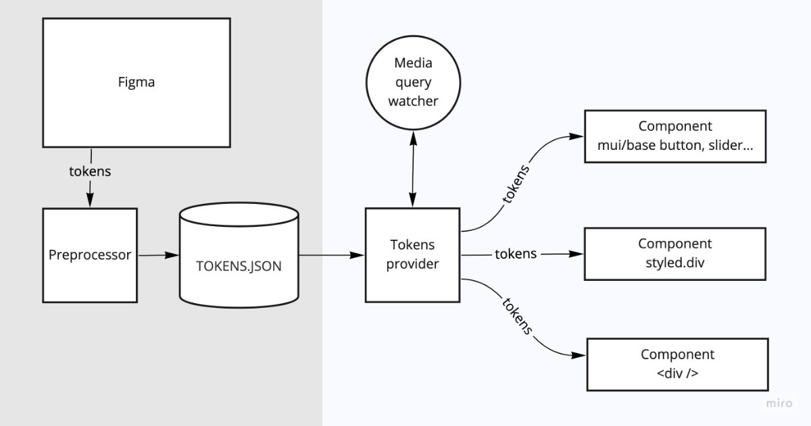

```
<TokensProvider>
   <App />
</TokensProvider>
```

```
const Component = ({ children }) => {
   
   const tokens = useTokens()

   const style = {
      ...tokens.composite.Component
   }

   return <div {...{ style }}>{ children }</div>

}
```

## Device use:

```
const Component = ({ children }) => {
   
   const { tokens: { composite: { Component: token } }, device } = useTokensAndMedia()

   const size = {
      width: device === "tablet" ? token.width : "100vw",
      height: device === "tablet" ? "100vh" : token.height,
   }

   const style = {
      ...token,
      ...size,
   }

   return <div {...{ style }}>{ children }</div>

}
```


## Color scheme use:

```
const Component = ({ children }) => {
   
   const [token, colors] = useTokens(["composite.Component", "colors.week"])

   const { scheme } = useMedia()

   const fill = {
      backgroundColor: colors[new Date().getDay()],
      ...(scheme === "dark" ? { filter: "brightness(50%)" } : {})
   }

   const style = {
      ...token,
      ...fill,
   }

   return <div {...{ style }}>{ children }</div>

}
```

## Use mui/base components:
```
import ButtonUnstyled from "@mui/base/ButtonUnstyled";
import { css } from "@emotion/css";
import { withTokens } from "../../providers/tokens";

const style = ({
   tokens: { composite: { Button } },
   variant = "action",
}) => css`
   all: unset;
   ${button[variant]?.default[0]};
   ${button[variant]?.default[1]};
   &:hover {
      ${button[variant]?.hover[0]};
   }
   &:active {
      ${button[variant]?.active[0]};
   }
   &:disabled {
      ${button[variant]?.disabled[0]};
      ${button[variant]?.disabled[1]}; 
   }
`;

const Button = withTokens(ButtonUnstyled, style);

export default Button;

...

<Button variant="link">About</Button>

<Button>Close</Button> { /* variant=action */ }

```